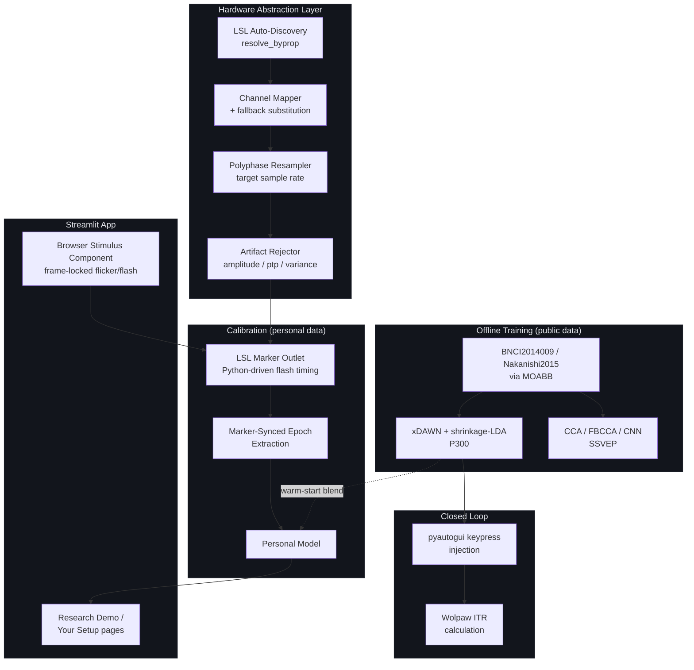
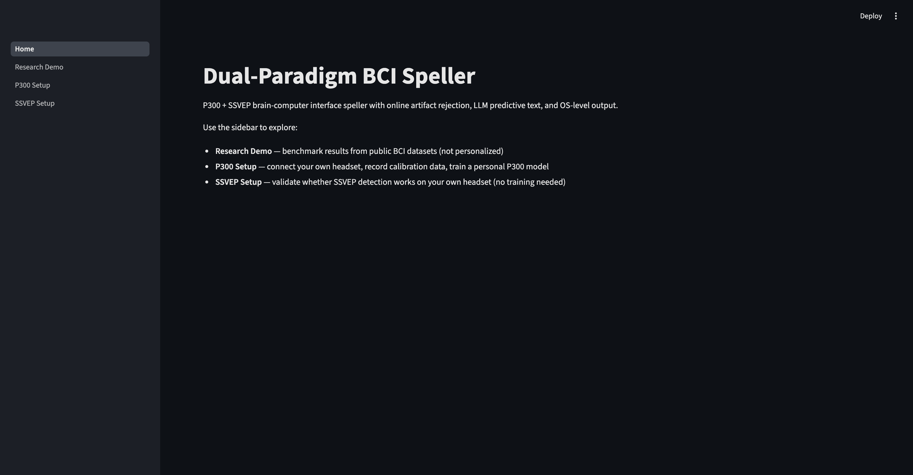
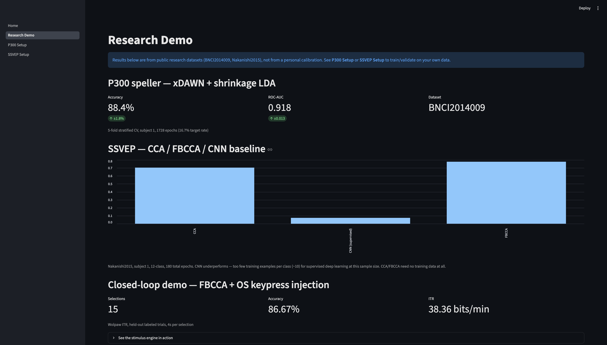
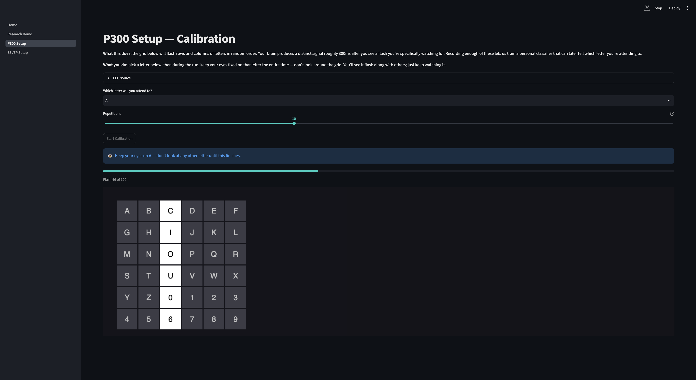
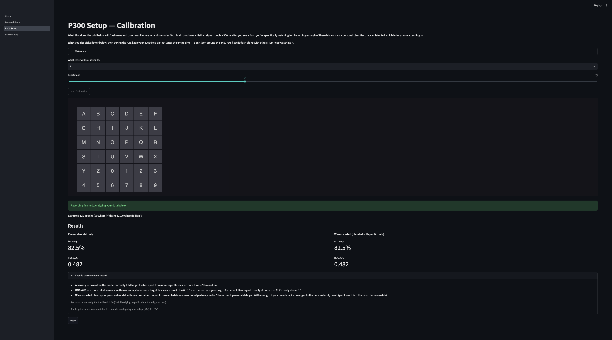
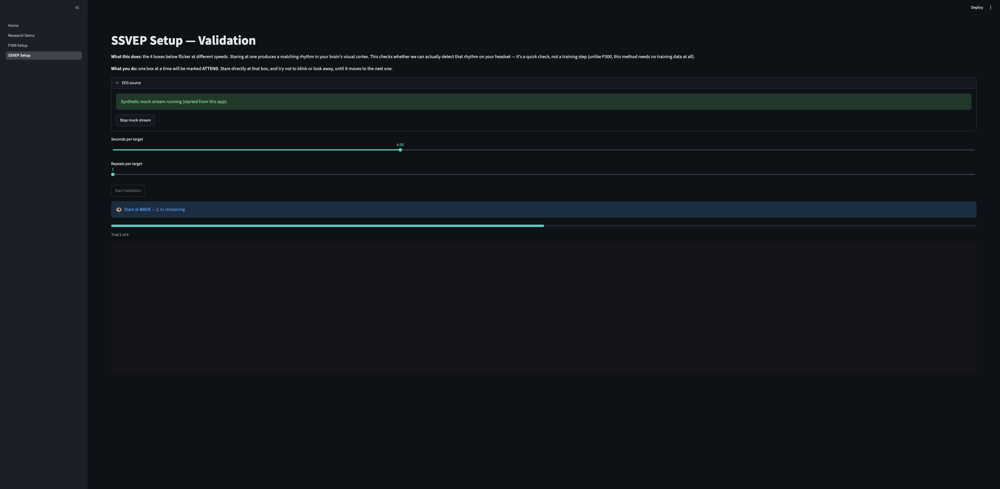
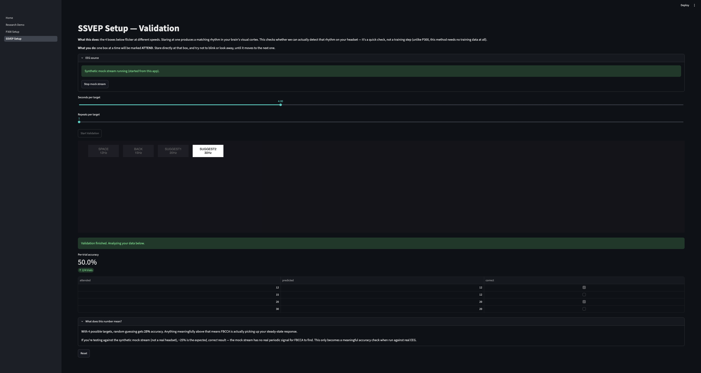

   

# Dual-Paradigm BCI Speller — P300 + SSVEP

An end-to-end brain-computer interface speller built on two classic paradigms (P300 and SSVEP), with online artifact rejection, LLM-assisted predictive text, OS-level keypress output, and a browser-based calibration tool for connecting a real headset. Built as a systems exercise: take two published BCI decoding methods from research paper to a working pipeline with a hardware abstraction layer, a real-time calibration workflow, and an honest account of exactly where "working on public research data" stops and "working for a real person on real hardware" would need to start.

**Further reading:** [`docs/PROJECT_NARRATIVE.md`](docs/PROJECT_NARRATIVE.md) (the full build story, bugs and all) · [`docs/decisions.md`](docs/decisions.md) (engineering decision log) · [`docs/ARCHITECTURE.md`](docs/ARCHITECTURE.md) (subsystem-by-subsystem design) · [`docs/BENCHMARKS.md`](docs/BENCHMARKS.md) (full methodology + per-fold numbers)

## What this is

- A hardware abstraction layer with LSL auto-discovery, per-device channel mapping (with declared fallback for headsets missing electrodes), polyphase resampling, and online artifact rejection (amplitude / peak-to-peak / sliding-window variance)
- A P300 speller: xDAWN spatial filtering + shrinkage-LDA, trained and cross-validated on real public data
- An SSVEP engine: standard CCA, filter-bank CCA, and a supervised CNN baseline, compared head-to-head on the same dataset
- A closed-loop demo wiring classifier output to `pyautogui` system keypress injection, with real-time ITR (Wolpaw formula) reported
- A local GPT-2 predictive-text layer integrated into a pygame speller UI
- A Streamlit app with two halves: a **Research Demo** showing the numbers above, and a **Your Setup** flow that walks a real user through connecting their own LSL stream, recording calibration data with proper marker-to-EEG sync, and training (P300) or validating (SSVEP) against their own signal — including a warm-start scheme that blends a public-data prior model with the user's personal one while they still have little data of their own

## What this is not

- **Not tested on real EEG hardware.** Every number below comes from public research datasets or a synthetic mock LSL stream. The calibration pipeline is verified to be *plumbed correctly* — marker timestamps line up with recorded EEG exactly as the flash schedule predicts — not verified to *detect a real person's signal*, because no real headset has been connected to it.
- **Not a solved calibration problem.** The warm-start prior model only overlaps the personal calibration montage on 3 of 5 channels (`Oz`, `Cz`, `Pz` — BNCI2014009 doesn't have `O1`/`O2`), so its usefulness is capped by that overlap. SSVEP "calibration" isn't training at all — CCA/FBCCA are zero-shot by design, so that wizard is a detectability check, not a model-fitting step.
- **Not benchmarked against a Riemannian/CSP baseline for either paradigm** — xDAWN+LDA and CCA/FBCCA were chosen as the standard, well-published approach for each paradigm respectively, not because they were shown to beat the alternatives here.
- **Not reviewed for clinical or assistive use.** No consent process, no usability testing with an actual target user, no safety review. This is a portfolio-grade systems project, not an assistive device.

## Architecture



## Screenshots

**Home** — entry point, links to the demo and both calibration wizards



**Research Demo** — real benchmark numbers from public data, plus a live SSVEP preview



**P300 Setup — mid-calibration** — live flash matrix, on-screen instructions, progress bar



**P300 Setup — results** — personal model vs. warm-started (blended with public data)



**SSVEP Setup — validation** — live per-target countdown and trial progress



**SSVEP Setup — results** — per-trial accuracy against the attended frequency



## Results

Summary below — full methodology, per-fold breakdowns, and the calibration-pipeline correctness checks are in [`docs/BENCHMARKS.md`](docs/BENCHMARKS.md).

| System | Result |
|---|---|
| P300 (xDAWN + shrinkage-LDA), `BNCI2014009` subject 1 | 88.4% ± 1.8% accuracy, 0.918 ± 0.013 ROC-AUC (5-fold CV) |
| SSVEP FBCCA, `Nakanishi2015` subject 1 (12-class) | 77.8% (vs. CCA 70.4%, supervised CNN 7.4% — too little data) |
| Closed loop (FBCCA + OS keypress injection) | 86.67% accuracy, 38.36 bits/min ITR, 15 selections |
| Calibration marker-EEG sync (mock stream) | 119 epochs extracted, target/non-target counts matched flash schedule exactly |

## Setup

```bash
git clone <this-repo-url>
cd bci-speller
python3.11 -m venv .venv
source .venv/bin/activate
pip install -r requirements.txt
```

**macOS:** LSL needs `liblsl` installed separately, and pylsl needs to find it explicitly:

```bash
brew install labstreaminglayer/tap/lsl
export PYLSL_LIB=/opt/homebrew/lib/liblsl.dylib   # add to ~/.zshrc to persist
```

## Running the system

**No hardware available?** Everything below can run against a synthetic mock stream:

```bash
python hardware/playback.py --source synthetic
```

**CLI / phase-by-phase scripts** (what the pipeline was originally built and verified against):

```bash
python scripts/train_p300.py
python scripts/train_ssvep.py
python scripts/run_closed_loop_demo.py
python ui/speller_app.py            # pygame speller with live LLM suggestions
```

**The app** (dashboard + calibration wizard):

```bash
cd app
streamlit run Home.py
```

## Project Structure

```
bci-speller/
├── hardware/            # HAL: LSL discovery, channel mapping, resampling, artifact rejection
├── paradigms/
│   ├── p300/            # epoching, xDAWN, classifier
│   └── ssvep/           # CCA, FBCCA, CNN baseline
├── llm/                 # GPT-2 next-word predictor
├── ui/                  # pygame speller (P300 matrix + SSVEP flicker + LLM suggestions)
├── os_hooks/            # pyautogui injection, Wolpaw ITR
├── scripts/             # CLI entry points, one per pipeline phase
├── calibration/         # LSL markers, background recorder, marker-synced epoching,
│                        # P300 calibration session, SSVEP validation session, warm-start blending
├── app/                 # Streamlit app
│   ├── Home.py, pages/  # Research Demo, Your Setup (P300), SSVEP Setup
│   └── components/stimulus/  # browser stimulus component (frame-locked, bidirectional JS<->Python)
└── docs/                # project narrative, decision log
```

## Limitations

Structural, not fixable by more time on this laptop alone:

- **No real headset has touched this code.** Everything is verified against public datasets or synthetic noise. Real validation requires an actual person, an actual headset, and an actual attempt to type something.
- **Warm-start channel overlap is thin.** The public P300 prior model only shares 3 of 5 HAL channels with the personal calibration montage. Its usefulness scales with that overlap, not with how much public data it was trained on.
- **SSVEP calibration validates, it doesn't train.** There's no equivalent of "personal SSVEP model" the way there is for P300, because CCA/FBCCA don't use training data in the first place.
- **Single-subject numbers throughout.** Every accuracy/AUC figure above is one subject on one public dataset — none of this has been checked for how much it varies across subjects (see roadmap).
- **No safety, consent, or usability review.** Appropriate for a portfolio project. Not appropriate grounds to use this with a real person who has no other way to communicate — that requires clinical oversight this project doesn't have.

## Engineering Roadmap

1. **Real hardware validation.** The only way to know if any of the calibration machinery here actually detects a real person's signal. Everything else is downstream of this.
2. **Cross-subject / leave-one-subject-out evaluation** for both paradigms, to quantify how much the reported single-subject numbers would move on a different person — directly relevant to how much the warm-start prior model can be trusted for someone who isn't in the training set.
3. **Adaptive calibration stopping.** Currently fixed repetition counts; tracking live cross-validated accuracy during a session and stopping early where confidence is already high (or extending where it isn't) would cut real calibration time, which is the actual adoption bottleneck for BCI in general.
4. **Riemannian/CSP baseline for P300**, to know whether xDAWN+LDA's numbers reflect a genuine advantage or are simply what any reasonable spatial-filtering approach gets on this dataset.
5. **Automated test suite.** The verification scripts under `scripts/verify_*.py` are manual, one-off checks; converting the numerical ones (channel mapping, resampling ratio, artifact thresholds, ITR formula) into a real `tests/` suite would catch regressions instead of relying on rereading terminal output.

## Citations

- **P300 dataset**: Aricò, P., Aloise, F., Schettini, F., Salinari, S., Mattia, D., & Cincotti, F. (2014). Influence of P300 latency jitter on event related potential-based brain-computer interface performance. *Journal of Neural Engineering*, 11(3).
- **SSVEP dataset**: Nakanishi, M., Wang, Y., Wang, Y.-T., & Jung, T.-P. (2015). A comparison study of canonical correlation analysis based methods for detecting steady-state visual evoked potentials. *PLoS ONE*, 10(10), e0140703.
- **xDAWN**: Rivet, B., Souloumiac, A., Attina, V., & Gibert, G. (2009). xDAWN algorithm to enhance evoked potentials: application to brain-computer interface. *IEEE Transactions on Biomedical Engineering*, 56(8), 2035–2043.
- **FBCCA**: Chen, X., Wang, Y., Gao, S., Jung, T.-P., & Gao, X. (2015). Filter bank canonical correlation analysis for implementing a high-speed SSVEP-based brain-computer interface. *Journal of Neural Engineering*, 12(4), 046008.
- **Benchmarking framework**: Jayaram, V., & Barachant, A. (2018). MOABB: trustworthy algorithm benchmarking for BCIs. *Journal of Neural Engineering*, 15(6), 066011.

## License

MIT License — see `LICENSE` for details.
